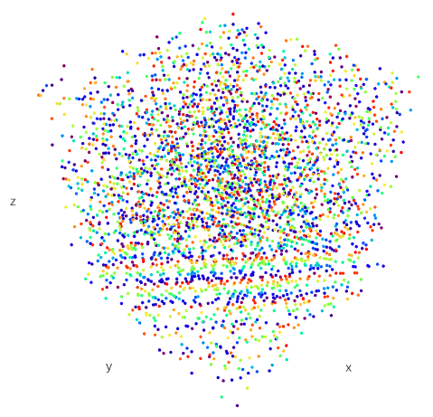

# Mersenne Twister party game

**Can you spot the difference between the C random number generator and
Mersenne Twister?**

Note: the game drops 5 to 11 low bits of the C PRNG state, depending on the
level. The actual implementation drops 16. That would make the game a bit
too difficult.
